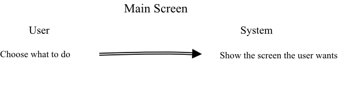
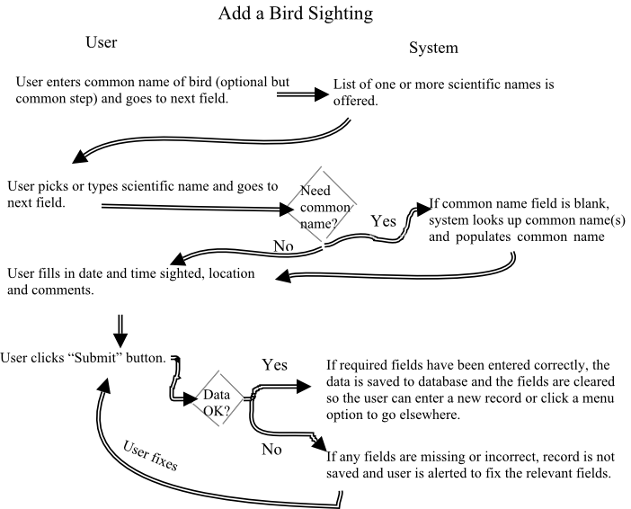
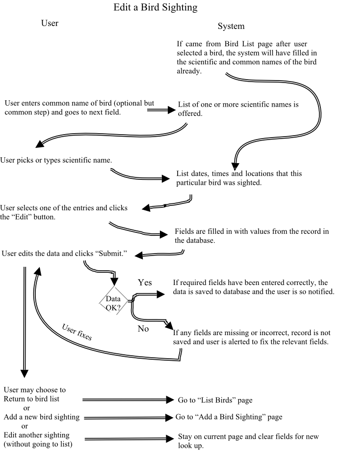

# Creature Sightings Log - Thinkful Demo project

A responsive website with features including:

*   Store your creature and plant sightings by date and species, along with your notes (in a Mongo DB).
*   Look up the scientific name of an organism from a common name.
*   Search for, list, update and delete previously entered records.

Originally designed to log only birds, the project currently allows logging of any life form listed in the ITIS database.

Features anticipated for Phase 2 (after I finish with my course):

*   Allow organisms to be grouped and/or restricted to a particular taxonomic class, such as just birds.
*   Look up a description and picture of an organism, courtesy of third-party websites.

**NOTES**

Because this is a demonstration project, your data **will be deleted** from time to time. When and if this becomes a production system, I will change this very page to let everyone know. If you have a strong desire or need for such a system, please [contact me](http://mendoclick.com/contact.htm) to discuss how we can work together to meet your needs.

## User Stories

1.  As an avid naturalist, I want to keep track of the animals and plants I have seen.
2.  As a nature enthusiast, I want to look up general information about animals and plants. (Phase 2)
3.  As a nature watcher, I want to confirm that I have the right organism's name by comparing features with what I observed.
4.  As a researcher, I want to generate statistics about sightings. (Phase 2)

## User Flows

NOTE: Replace "bird" with "animal/plant" in the flows below.

## Wireframes

NOTE: The educational emphasis was on the back-end server, so screen development was deliberately kept simple.

