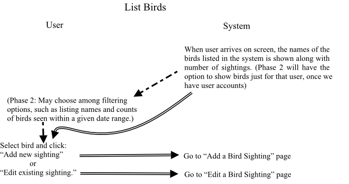

# Bird Watcher's Bird Log - Thinkful Demo project

A responsive website with features including:

*   Store your bird sightings by date and species, along with your notes (in a Mongo DB).
*   Look up the scientific name of a bird from a common name.
*   Look up a description and picture of a bird (courtesy of The Cornell Lab of Ornithology's eBird project).

**NOTE**

Because this is a demonstration project, your data **will be deleted** from time to time. When and if this becomes a production system, I will change this very page to let everyone know. If you have a strong desire or need for such a system, please [contact me](http://mendoclick.com/contact.htm) to discuss how we can work together to meet your needs.

## User Stories

1.  As an avid bird watcher, I want to keep track of the birds I have seen.
2.  As a bird enthusiast, I want to look up general information about a bird.
3.  As a bird watcher, I want to confirm that I have the right bird by comparing features with what I observed.
4.  As a researcher, I want to generate statistics about bird sightings.

## User Flows