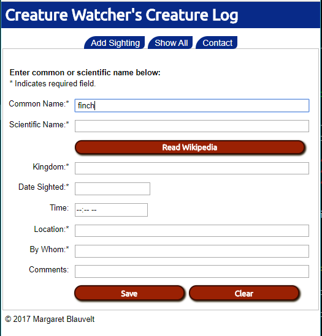
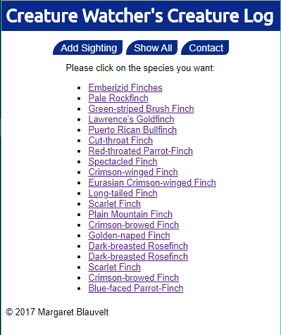
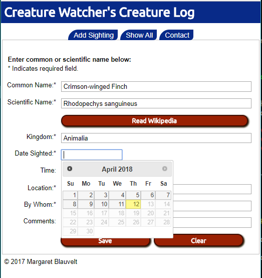
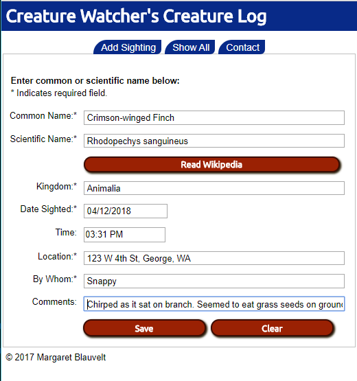
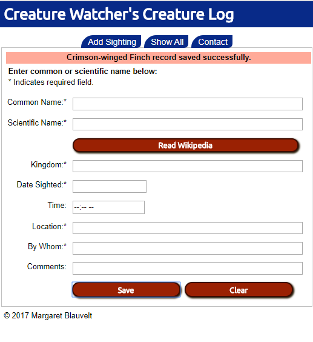
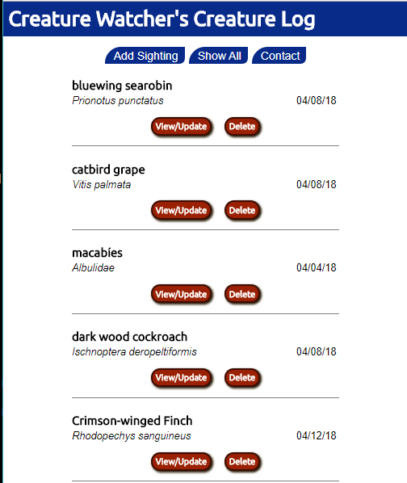
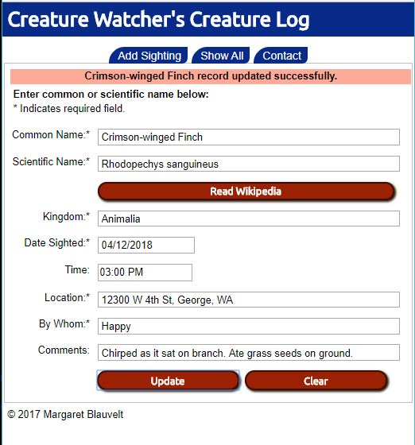
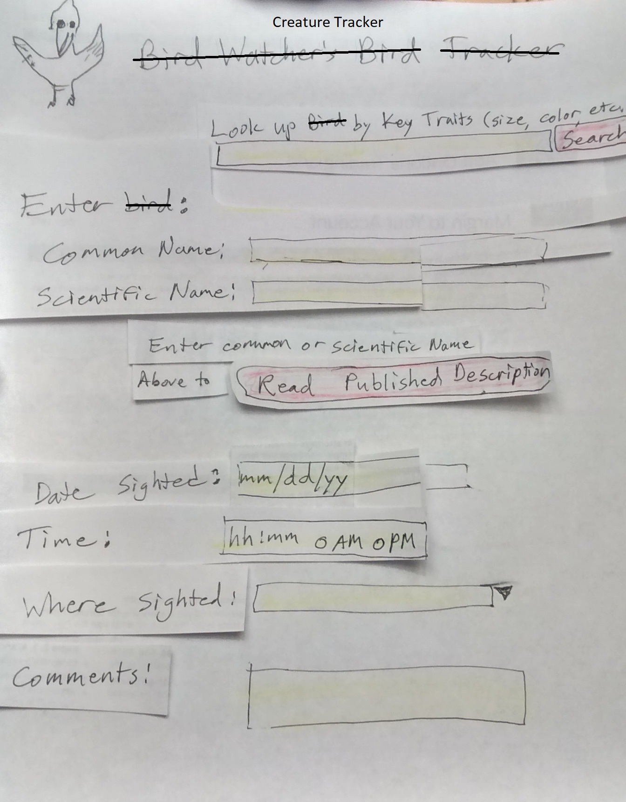
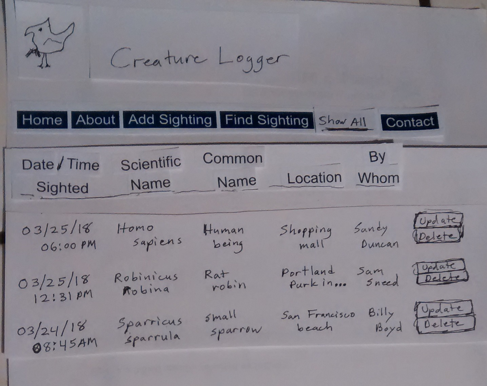

# Creature Watcher's Creature Log - Thinkful Demo Project

## A responsive website for logging wildlife sightings.

### Demo location: [Live at Heroku - stark-mesa-53003.herokuapp.com](https://stark-mesa-53003.herokuapp.com)

### Features include:

-   Store your creature and plant sightings by date and species, along with your notes (in a Mongo DB).
-   Look up the scientific name of an organism from a common name.
-   List, update and delete previously entered records.
-   Jump to Wikipedia to read about the animal or plant you are currently on. Wikipedia will be passed the scientific name if available or the common name if not.

Originally designed to log only birds, the project currently allows logging of any life form listed in the [Integrated Taxonomic Information System](https://www.itis.gov/) (ITIS) database.

  

Enter common name and tab or click next field (above) then pick from a list of similar common names (below).

  

  

Scientific name and kingdom are automatically filled in. Type or click on date.

  

Enter time, location and user name and click the 'Save' button. Note confirmation (below) that you successfully saved the record.

  

  

List animals and plants in the database which you can view, update or delete.

  

Update any fields you wish. Note confirmation that update was successful.

### NOTES

Because this is a demonstration project, your data **will be deleted** from time to time. When and if this becomes a production system, I will change this very page to let everyone know. If you have a strong desire or need for such a system, please [contact me](http://mendoclick.com/contact.htm) to discuss how we can work together to meet your needs.

### API and Other Technology Credits

This app uses the  public Application Programming Interface (API) provided by the [Integrated Taxonomic Information System (ITIS) at www.itis.gov](https://www.itis.gov/).

Integrated tests are run at the server at [Travis Cl at https://travis-ci.org/](https://travis-ci.org/).

Heroku hosts the [demo](https://stark-mesa-53003.herokuapp.com). [Home page: www.heroku.com](https://www.heroku.com/)

The app is written using the following:

-   MongoDB (database)
-   Mongoose (data modeling library for MongoDB)
-   Node.js (backend server framework)
-   Espress.js (framework for Node.js)
-   JQuery (JavaScript library)
-   JavaScript (Web programming language)
-   HTML (markup language for Web pages)
-   CSS (style definitions for HTML pages)

### Features anticipated for Phase 2:

-   Create authentication and individual user accounts.
-   Add search and sorting capabilities for entered sightings.
-   When searching similar common names, allow organisms to be grouped and/or restricted to a particular taxonomic class, such as just birds or just arthropods.
-   Besides linking to Wikipedia pages, link or pull data in from other relevant websites, such as The Cornell Lab or Ornithology's [ebird](https://ebird.org/) site.
-   Save your own pictures of organisms and link to them from your log entries.

### User Stories

1.  As an avid naturalist, I want to keep track of the animals and plants I have seen.
2.  As a nature enthusiast, I want to look up general information about animals and plants.
3.  As a nature watcher, I want to confirm that I have the right organism's name by comparing features with what I observed.
4.  As a researcher, I want to generate statistics about sightings. (Phase 2)

### User Flows

NOTE: Replace "bird" with "animal/plant" in the flows below.

  

  

### Wireframes

NOTE: These were done at the beginning of the process, before the screens were developed. Some design changes were made along the way.

  

 

  

